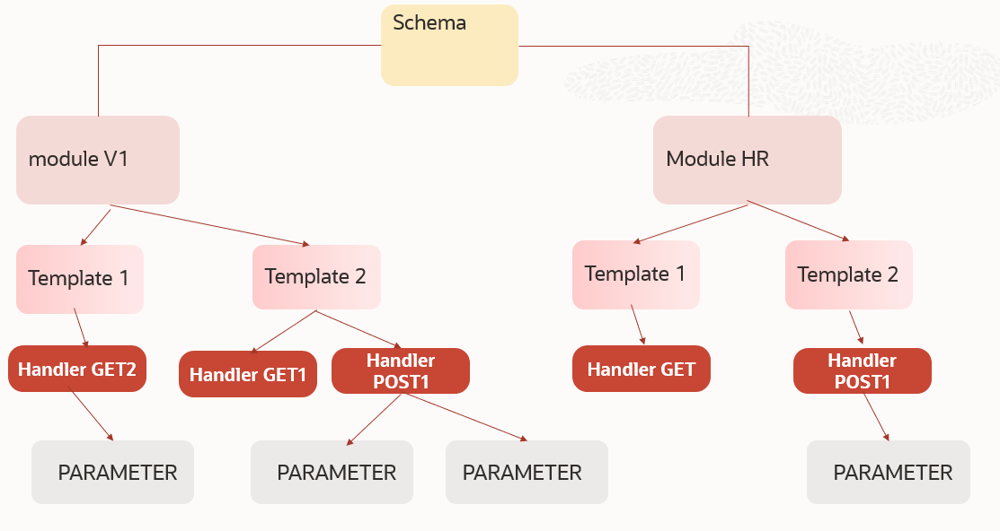
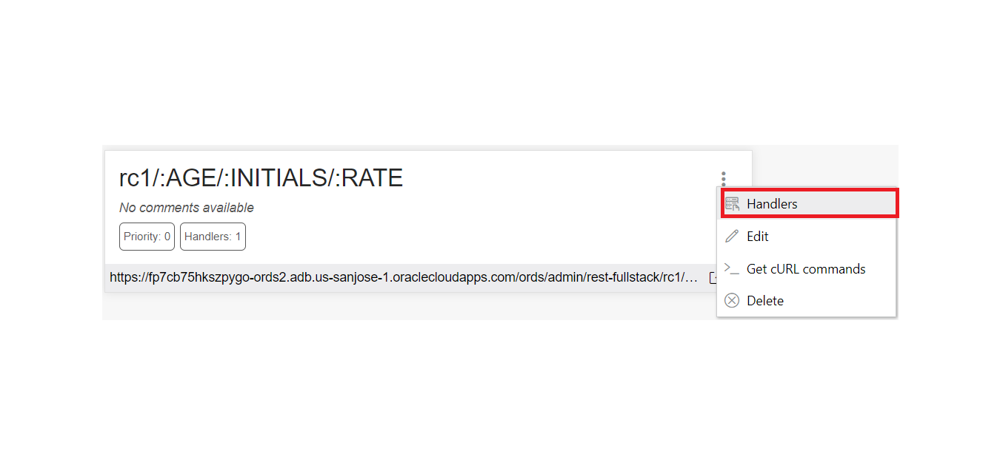
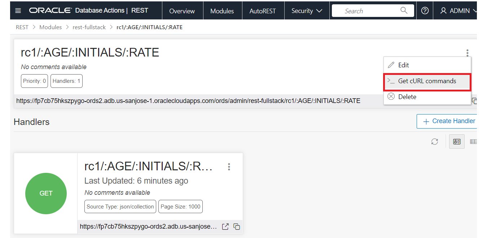

# Backend

## Introduction

In this lab,
- You will create a simple Oracle function and expose it as ORDS.
- you will also test how to secure the ords useing app user and key code.


Estimated time: ~45 minutes.

### Oracle Rest API

Oracle REST Data Services (ORDS) bridges HTTPS and your Oracle Database. A mid-tier Java application, ORDS provides a Database Management REST API, SQL Developer Web, a PL/SQL Gateway, SODA for REST, and the ability to publish RESTful Web Services for interacting with the data and stored procedures in your Oracle Database.

The Java EE implementation offers increased functionality including a command line based configuration, enhanced security, file caching, and RESTful web services. Oracle REST Data Services also provides increased flexibility by supporting deployments using Oracle WebLogic Server, Apache Tomcat, and a standalone mode. Oracle REST Data Services further simplifies the deployment process because there is no Oracle home required, as connectivity is provided using an embedded JDBC driver.

While Oracle REST API will work on any Oracle Database, with the implementation of REST Interface in ADB (Autonomous Database), you can consider ADB as a development platform that stores all your data, but also expose all your tables, views , procedures and functions as REST APIs in a secure cloud platform for all development and integration needs.

We'll look at the creation of restful web services using oracle rest data services in pl/sql.
There are other livelabs session that discuss the auto rest functionality which is really quick and easy if you want api's that interact with a single table or view. In some cases we don't want to expose services which are that atomic as it requires the person using the api to understand the database design instead we want to expose real-world tasks as services. for example it's unlikely the creation of a new employee involves an insert into a single table but the creation of an employee is a real-world task we want to expose for this reason it may be better to create pl/sql api's to perform the work and expose those as restful web services to keep things simple all the examples in this lab will be really small and won't include any proper error handling.

Watch the video below for a comprehensive overview of REST and how ORDS provides what you need to deliver RESTful Services for your Oracle Database.

[](youtube:rvxTbTuUm5k)

<if type="odbw">If you would like to watch us do the workshop, click [here](https://youtu.be/t0MkIxMKhDo).</if>


### Objectives

- Connect to your Autonomous Database using Database Actions/SQL Developer Web
- Create an PL/SQL function
- Create and manual REST enabled PL/SQL function.
- Publish RESTful services for various database objects
- Secure the REST endpoints

### Prerequisites

- This lab requires the completion of lab 1 and the provision of the OCI components.


## Task 1: Connect to sqldevweb and run the script below.

Run the following script to create a plsql function. This function will take input of current AGE, Dollar value of your current assests and rate of interest you think you can grow until the retairement age of 67.
```
<copy>
CREATE TYPE rc_o AS OBJECT
( age number,
	balance number
 );

CREATE OR REPLACE TYPE rc_ftt IS TABLE OF rc_o;

CREATE or REPLACE FUNCTION rc_ft2 (  
age      IN   NUMBER  ,
initials IN   NUMBER ,
rate     IN NUMBER)

RETURN rc_ftt PIPELINED
	IS  
		 retval rc_ftt := rc_ftt( );
		 principle number;
		 balance   number ;
 BEGIN  
			principle := INITIALS ;

		 FOR indx IN 1..67-age
		 LOOP
				principle := round( principle * rate/100 + principle ) ;
				PIPE ROW ( rc_o(indx + age,principle));
		 END LOOP;  
		 return ;

 END rc_ft2;
</copy>
```

2. execute the plsql function and confirm it works in sqldevWeb. In this example, We are passing age as 45,total assats as 100000 and rate of interest to earn about 7 percent.

```
<copy>

		SELECT * FROM TABLE ( rc_ft2 ( 45, 1000000, 7)) names ;
</copy>
```


Not that the function is created in the database, Next we can expose it as a API.

## Task 2: REST enable schema and objects.

The ORDS JDBC connection pools to your Oracle Database are populated with connections using the ORDS_PUBLIC_USER account.

When you call REST calls on your database, ORDS picks a session from the pool, and Proxy Connects to the REST Enabled Schema defined for the RESTful Service or Endpoint.

If I want to publish a service in the ADMIN schema, then I must FIRST REST Enable the ADMIN user. When you do this, you are also telling ORDS that it’s allowed to login as ADMIN for a SQL Developer Web session.

1. Enable Schema

we enable ADMIN schema and assign the base path of admin. This is a schema alias used in the web service URLs which lets ORDS know it's dealing with objects in the admin user schema.
```
<copy>
BEGIN
	 ORDS.ENABLE_SCHEMA(p_enabled => TRUE,
											p_schema => 'ADMIN',
											p_url_mapping_type => 'BASE_PATH',
											p_url_mapping_pattern => 'admin',
											p_auto_rest_auth => FALSE);
	 COMMIT;
END;
</copy>
```

2. Create  manually.
   There are other livelab workshops that show who to create auto-ORDS through GUI option. When we have more complex handler definitions, it can be accomplished manually.

	 To create ORDS,
	 1. Define a Module with a BASE_PATH. ( Eg HR, ERP, Finance)
	 2. Define a Template to describe how you want to pass the parameters and URLs. ( like HR/addEMP HR/dropEMP)
	 3. Define a Handler which instructs what to do when you get this template.(GET and POST calls)
	 4. Define parameters if the GET and POST handlers need to pass parameters

   

	 we define a module which is a collection of templates or URL patterns. In our case module name and base
	 path match
   ```
	<copy>
	BEGIN
  ORDS.DEFINE_MODULE(
      p_module_name    => 'rest-fullstack',
      p_base_path      => '/rest-fullstack/',
      p_items_per_page => 1000,
      p_status         => 'PUBLISHED',
      p_comments       => NULL);
 END;
 /
</copy>
```
we then define a template which is a collection of handlers.
The combination of the schema alias, module base path and template pattern make up the webservice URL or endpoint
so in this case we expect url to include  http://<ords-server>/hr/rest-fullstack/rc1?
```
<copy>
  BEGIN
  ORDS.DEFINE_TEMPLATE(
      p_module_name    => 'rest-fullstack',
      p_pattern        => 'rc1/:AGE/:INITIALS/:RATE',
      p_priority       => 0,
      p_etag_type      => 'HASH',
      p_etag_query     => NULL,
      p_comments       => NULL);

  ORDS.DEFINE_HANDLER(
      p_module_name    => 'rest-fullstack',
      p_pattern        => 'rc1/:AGE/:INITIALS/:RATE',
      p_method         => 'GET',
      p_source_type    => 'json/collection',
      p_items_per_page => 1000,
      p_mimes_allowed  => NULL,
      p_comments       => NULL,
      p_source         => 'SELECT * FROM TABLE ( rc_ft2 ( :AGE, :INITIALS,:RATE)) ');


COMMIT;

END;
/

</copy>
```

## Task 3 : Test manualy created ORDS

   Note that ORDS can be configured in on-prem as well. However, since this workshop is using ORDS with ADB, we need to find the endpoint for the ORDS and either construct the URL or navigate to the GUI and verify our creation.

1. Under DB Actions click on REST.
 Start by signing in as the admin using Database Actions if not already there. Once logged in, click the SQL tile.

	 
2.	 Then click on Modules
  

3. From the Modules page, click on the upper right corner and navigate to templates.
   

4. From the Template page, navigate to the Handlers
   

5. From Handers page, navigate to Details
     

6.	 Run the query defined in the handler. You can pass the bind variable AGE,INITIAL asset value and PERCENT rate of growth.
     

7. you can also construct a curl script from the Handler page "_ get cURL commands". Fill in the bind variables

    

8. You can run the url constucted from the handler and run in a bouser and get json data back.

   

  Optionally, you could run your cURL script from you desktop or Oracle Cloud shell and verifiy your ORDS is working.
	Our example passes the the data in the URL. so it is possble to directly access the url. However, in most senarious, we usually pass the variable as part of the body or header of the GET request.
  Eg.
	```

	 curl --location https://g1ec399e4b6fed3-mtdrdb.adb.ap-sydney-1.oraclecloudapps.com/ords/admin/rest-fullstack/rc1/47/2000000/7

{"items":[{"age":48,"balance":2140000},{"age":49,"balance":2289800},{"age":50,"balance":2450086},{"age":51,"balance":2621592},{"age":52,"balance":2805103},{"age":53,"balance":3001460},{"age":54,"balance":3211562},{"age":55,"balance":3436371},{"age":56,"balance":3676917},{"age":57,"balance":3934301},{"age":58,"balance":4209702},{"age":59,"balance":4504381},{"age":60,"balance":4819688},{"age":61,"balance":5157066},{"age":62,"balance":5518061},{"age":63,"balance":5904325},{"age":64,"balance":6317628},{"age":65,"balance":6759862},{"age":66,"balance":7233052},{"age":67,"balance":7739366}],"hasMore":false,"limit":1000,"offset":0,"count":20,"links":[{"rel":"self","href":"https://g1ec399e4b6fed3-mtdrdb.adb.ap-sydney-1.oraclecloudapps.com/ords/admin/rest-fullstack/rc1/47/2000000/7"},{"rel":"describedby","href":"https://g1ec399e4b6fed3-mtdrdb.adb.ap-sydney-1.oraclecloudapps.com/ords/admin/metadata-catalog/rest-fullstack/rc1/47/2
vijay_bale@cloudshell:~ (ap-sydney-1)$ curl --location  "https://fp7cb75hkszpygo-db202201121316.adb.us-sanjose-1.oraclecloudapps.com/ords/admin/open-api-catalog/rest-v3/47/1000000/7"

```

 Now That the database function can be accessed as a ORDS,
## Acknowledgements

* **Author** -  - Vijay Balebail, Dir. Product Management.
