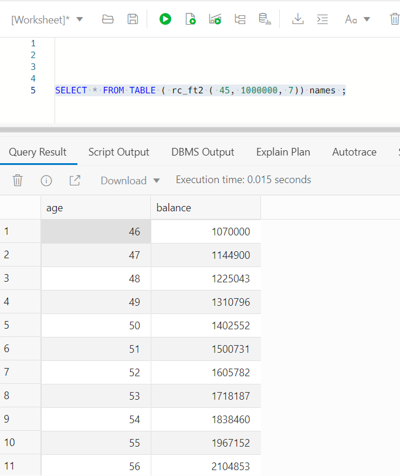
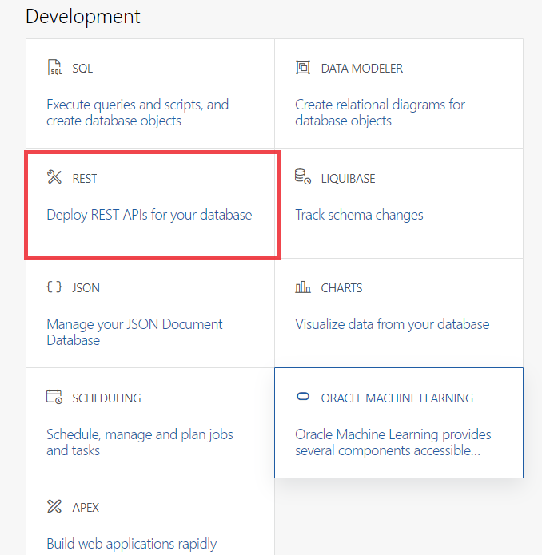

# Backend

## Introduction

In this lab,
- You will create a deploy a simple Python application in Oracle Kubernates.
- Test its working.

Objectives
- Set values for environment variables
- Build and deploy the Docker image of the application
- Deploy the image on the Oracle Kubernetes Engine (OKE)
- Describe the steps for Undeploying
-	Configure the API Gateway
- Test the backend application


Estimated time: ~45 minutes.

### Prerequisites

- This lab requires the completion of lab 1 and the provision of the OCI components.


## Task 1: Set values for workshop environment variables

1. Set the root directory of the workshop

	```
	<copy>export MTDRWORKSHOP_LOCATION=~/mtdrworkshop</copy>
	```
2. Run source addAndSourcePropertiesInBashrc.sh

	The following command will set the values of environment variables in mtdrworkshop.properties and source ~/.bashrc

	```
	<copy>cd $MTDRWORKSHOP_LOCATION; source addAndSourcePropertiesInBashrc.sh</copy>
	```

## Task 2: Build and push the Docker images to the OCI Registry

1. Ensure that the "DOCKER_REGISTRY" variable is set

 Example: `<region-key>.ocir.io/<object-storage-namespace>/<firstname.lastname>/<repo-name>`
 If the variable is not set or is an empty string, the push will fail (but the docker image will be built).

2. copy the Python/Flask calculator app from github.

     ```
     <copy>
      mkdir ~/mtdrworkshop/python
      cd ~/mtdrworkshop/python
      git clone https://github.com/vijaybalebail/Todo-List-Dockerized-Flask-WebApp.git
      cd Todo-List-Dockerized-Flask-WebApp
      </copy>
  	 ```

3. We now can build the a docker image with Python and the  application main.js.
   Look at the construct of the Dockerfile and execute the command to build the docker image.

    ```
    <copy> docker build  -t saveings-flask:latest . </copy>

				Sending build context to Docker daemon  148.5kB
		Step 1/14 : FROM vijaybalebail/python
		---> b003cfb0d124
		Step 2/14 : RUN pip3.6 install bottle &&     python3.6 -m pip install bottle &&     pip3.6 install flask &&     python3.6 -m pip install flask &&    pip3.6 install requests &&    python3.6 -m pip install requests
		---> Using cache


		---> 33e08bea5b6a
		Step 14/14 : CMD exec python3.6 main.py
		---> Using cache
		---> a8f58c21007d
		Successfully built a8f58c21007d
		Successfully tagged savings:latest

    ```

    Verify that the images are CREATED.
    ```
    $ <copy>
    docker images</copy>

    REPOSITORY          TAG                 IMAGE ID            CREATED             SIZE
    savings             latest              02f268c26542        34 seconds ago      352MB
    oraclelinux         7-slim              0a28ba78f4c9        2 months ago        132MB

    ```
## Task 3: Run Docker image locally and verify.
   We created our image using the command docker build. Now that we have an image, we can run that image and see if our application is running correctly. Since we are running a application that listens on a port, we will have to run this in Detach or background mode.

  1. Run image locally and verify the image is running.

     ```
     <copy>
     docker run -d  -p 8080:8080  savings:latest
     docker ps
     </copy>
      $    docker ps
      CONTAINER ID        IMAGE                COMMAND                   PORTS                    NAMES
      b167d3a24057        savings:latest       "/bin/sh -c 'python3…"    0.0.0.0:5003->5000/tcp   relaxed_shirley

     ```

  2. Run curl get script to verify you can access data locally.

		 ```
			<copy>
			 curl -GET http://0.0.0.0:8080/name/anyname	 
			</copy>
		 ```
       My first web app! By <strong>anyname</strong>.

## Task 4: Tag & push image to the registry.

   1. Now that you have a docker image running locally, you are now ready to run it from OKE cluster.
   Give a tag to the image that you're going to push to Oracle Cloud Infrastructure Registry by entering:
     ```
     <copy>
     docker tag savings:latest $DOCKER_REGISTRY/savings:latest
     docker push $DOCKER_REGISTRY/savings:latest
     </copy>
     ```

  In a couple of minutes, you should have successfully built and pushed the images into the OCIR repository.

  2.  Check your container registry from the **root compartment**
    - Go to the Console, click the hamburger menu in the top-left corner and open
    **Developer Services > Container Registry**.

   

3. Mark Access as Public  (if Private)  
   (**Actions** > **Change to Public**):

   


## Task 5: Deploy on Kubernetes and Check the Status

1. Verify the todo.yaml file.
   Ensure you have the image name in oracle docker registory, the name of the imagePullSecret that was created in step 5 of lab1.

	```
	<copy>cd ~/mtdrworkshop/python/Todo-List-Dockerized-Flask-WebApp;
	      cp todo_template.yaml todo.yaml
        sed -i "s|%DOCKER_REGISTRY%|${DOCKER_REGISTRY}|g" todo.yaml
        kubectl create -f todo.yaml
  </copy>
	```

2. Check the status using the following commands. Verify the status is running for pods and you have a external-ip for LoadBalancer. You may have to rerun the command as it could take a couple of minutes to allocate a ip-address.
    ```
     $ <copy>
      kubectl get all </copy>
     $ kubectl get all
    NAME                                      READY   STATUS             RESTARTS   AGE
    pod/todo-deployment-657895dd59-qd89j      1/1     Running            0          3m1s

    NAME                   TYPE           CLUSTER-IP    EXTERNAL-IP      PORT(S)          AGE
    service/kubernetes     ClusterIP      10.96.0.1     <none>           443/TCP          32h
    service/todo-service   LoadBalancer   10.96.77.65   132.226.36.134   8080:31093/TCP   3m1s

    NAME                                 READY   UP-TO-DATE   AVAILABLE   AGE
    deployment.apps/todo-deployment      1/1     1            1           3m2s

    NAME                                            DESIRED   CURRENT   READY   AGE
    replicaset.apps/todo-deployment-657895dd59      1         1         1       3m2s

    ```


	The following command returns the Kubernetes service of ToDo application with a load balancer exposed through an external API
	```
	<copy>kubectl get services</copy>
	```

	

3. $ kubectl get pods
	```
	<copy>kubectl get pods</copy>
	```

	

4. Continuously tailing the log of one of the pods

  $ kubectl logs -f <pod name>
  Example kubectl logs -f todo-deployment-657895dd59-qd89j

5. For debugging deployment issues, you can run describe command and look at the errors at the end.

    kubectl describe pod <pod name>
    Example kubectl describe pod todo-deployment-657895dd59-qd89j

6. Now that your application has a external ipaddress, you can now access it both through curl and any web browser.
    ```
    curl -X GET http://<external_ipaddress>:8080/todolist
    or
    open a browser to the link http://<external_ipaddress:8080/todolist.
    ```
    

    In this app,  Flask app provides end points and data from ADB. The GUI is rendered using https://github.com/Semantic-Org/Semantic-UI in a html templates.

## Task 6: Configure the API Gateway (optional steps)

A common requirement is to build an API endpoints for docker applications with the HTTP/HTTPS URL of a back-end service.
This can be done using Oracle API Gateway service.

The API Gateway protects any RESTful service running on Container Engine for Kubernetes, Compute, or other endpoints through policy enforcement, metrics and logging.
Rather than exposing the Todo App directly, we will use the API Gateway to define cross-origin resource sharing (CORS).

1. From the hamburger  menu navigate **Developer Services** > **API Management > Create Gateway**
   

2. Configure the basic info: name, compartment, VCN and Subnet
    - VCN: pick on of the vitual circuit network
    - Subnet pick the public subnet (svclbsubnet)

	The click "Create".
  	

3. Click on Todolist gateway
    

4. Click on Deployments
   

5. Create a todolist deployment
   

6. Configure the routes: we will define two routes:
    - /tododo for the first two APIs: GET, POST and OPTIONS
    

    - add  /todolist/delete route API: (GET, PUT and DELETE)
	   

     - add  /todolist/add route APIs.
 	   

     - add  /todolist/update route API.
      


## Task 7: Testing the backend application through the API Gateway

1. Navigate to the newly create Gateway Deployment Detail an copy the endpoint
   

2. Testing through the API Gateway endpoint
  postfix the gateway endpoint with "/todolist/todos" as shown in the image below


  It should display the Todo Item(s) in the TodoItem table. At least the row you have created in Lab 1.

   

That is it. You have now exposed the applications endpoints through Oracle API Gateway.

## Acknowledgements

* **Author** -  - Vijay Balebail, Dir. Product Management.


### Oracle Rest API


Oracle REST Data Services (ORDS) bridges HTTPS and your Oracle Database. A mid-tier Java application, ORDS provides a Database Management REST API, SQL Developer Web, a PL/SQL Gateway, SODA for REST, and the ability to publish RESTful Web Services for interacting with the data and stored procedures in your Oracle Database.

The Java EE implementation offers increased functionality including a command line based configuration, enhanced security, file caching, and RESTful web services. Oracle REST Data Services also provides increased flexibility by supporting deployments using Oracle WebLogic Server, Apache Tomcat, and a standalone mode. Oracle REST Data Services further simplifies the deployment process because there is no Oracle home required, as connectivity is provided using an embedded JDBC driver.

While Oracle REST API will work on any Oracle Database, with the implementation of REST Interface in ADB (Autonomous Database), you can consider ADB as a development platform that stores all your data, but also expose all your tables, views , procedures and functions as REST APIs in a secure cloud platform for all development and integration needs.

We'll look at the creation of restful web services using oracle rest data services in pl/sql.
There are other livelabs session that discuss the auto rest functionality which is really quick and easy if you want api's that interact with a single table or view. In some cases we don't want to expose services which are that atomic as it requires the person using the api to understand the database design instead we want to expose real-world tasks as services. for example it's unlikely the creation of a new employee involves an insert into a single table but the creation of an employee is a real-world task we want to expose for this reason it may be better to create pl/sql api's to perform the work and expose those as restful web services to keep things simple all the examples in this lab will be really small and won't include any proper error handling.

Watch the video below for a comprehensive overview of REST and how ORDS provides what you need to deliver RESTful Services for your Oracle Database.

[](youtube:rvxTbTuUm5k)

<if type="odbw">If you would like to watch us do the workshop, click [here](https://youtu.be/t0MkIxMKhDo).</if>


### Objectives

- Connect to your Autonomous Database using Database Actions/SQL Developer Web
- Create an PL/SQL function
- Create and manual REST enabled PL/SQL function.
- Publish RESTful services for various database objects
- Secure the REST endpoints

### Prerequisites

- This lab requires the completion of lab 1 and the provision of the OCI components.


## Task 1: Connect to sqldevweb and run the script below.

Run the following script to create a plsql function. This function will take input of current AGE, Dollar value of your current assests and rate of interest you think you can grow until the retairement age of 67.
```
<copy>
CREATE TYPE rc_o AS OBJECT
( age number,
	balance number
 );

CREATE OR REPLACE TYPE rc_ftt IS TABLE OF rc_o;

CREATE or REPLACE FUNCTION rc_ft2 (  
age      IN   NUMBER  ,
initials IN   NUMBER ,
rate     IN NUMBER)

RETURN rc_ftt PIPELINED
	IS  
		 retval rc_ftt := rc_ftt( );
		 principle number;
		 balance   number ;
 BEGIN  
			principle := INITIALS ;

		 FOR indx IN 1..67-age
		 LOOP
				principle := round( principle * rate/100 + principle ) ;
				PIPE ROW ( rc_o(indx + age,principle));
		 END LOOP;  
		 return ;

 END rc_ft2;
</copy>
```

2. execute the plsql function and confirm it works in sqldevWeb. In this example, We are passing age as 45,total assats as 100000 and rate of interest to earn about 7 percent.

```
<copy>

		SELECT * FROM TABLE ( rc_ft2 ( 45, 1000000, 7)) names ;
</copy>
```


Not that the function is created in the database, Next we can expose it as a API.

## Task 2: REST enable schema and objects.

The ORDS JDBC connection pools to your Oracle Database are populated with connections using the ORDS_PUBLIC_USER account.

When you call REST calls on your database, ORDS picks a session from the pool, and Proxy Connects to the REST Enabled Schema defined for the RESTful Service or Endpoint.

If I want to publish a service in the ADMIN schema, then I must FIRST REST Enable the ADMIN user. When you do this, you are also telling ORDS that it’s allowed to login as ADMIN for a SQL Developer Web session.

1. Enable Schema

we enable ADMIN schema and assign the base path of hr.This is a schema alias used in the web service URLs which lets ORDS know it's dealing with objects in the admin user schema.
```
<copy>
BEGIN
	 ORDS.ENABLE_SCHEMA(p_enabled => TRUE,
											p_schema => 'ADMIN',
											p_url_mapping_type => 'BASE_PATH',
											p_url_mapping_pattern => 'hr',
											p_auto_rest_auth => FALSE);
	 COMMIT;
END;
</copy>
```

2. Create  manually.
   There are other livelab workshops that show who to create auto-ORDS through GUI option. When we have more complex handler definitions, it can be accomplished manually.

	 To create ORDS,
	 1. Define a Module with a BASE_PATH. ( Eg HR, ERP, Finance)
	 2. Define a Template to describe how you want to pass the parameters and URLs. ( like HR/addEMP HR/dropEMP)
	 3. Define a Handler which instructs what to do when you get this template.(GET and POST calls)
	 4. Define parameters if the GET and POST handlers need to pass parameters

   

	 we define a module which is a collection of templates or URL patterns. In our case module name and base
	 path match
   ```
	<copy>
	BEGIN
  ORDS.DEFINE_MODULE(
      p_module_name    => 'rest-fullstack',
      p_base_path      => '/rest-fullstack/',
      p_items_per_page => 1000,
      p_status         => 'PUBLISHED',
      p_comments       => NULL);
 END;
 /
</copy>
```
we then define a template which is a collection of handlers.
The combination of the schema alias, module base path and template pattern make up the webservice URL or endpoint
so in this case we expect url to include  http://<ords-server>/hr/rest-fullstack/rc1?
```
<copy>
  BEGIN
  ORDS.DEFINE_TEMPLATE(
      p_module_name    => 'rest-fullstack',
      p_pattern        => 'rc1/:AGE/:INITIALS/:RATE',
      p_priority       => 0,
      p_etag_type      => 'HASH',
      p_etag_query     => NULL,
      p_comments       => NULL);

  ORDS.DEFINE_HANDLER(
      p_module_name    => 'rest-fullstack',
      p_pattern        => 'rc1/:AGE/:INITIALS/:RATE',
      p_method         => 'GET',
      p_source_type    => 'json/collection',
      p_items_per_page => 1000,
      p_mimes_allowed  => NULL,
      p_comments       => NULL,
      p_source         => 'SELECT * FROM TABLE ( rc_ft2 ( :AGE, :INITIALS,:RATE)) ');


COMMIT;

END;
/

</copy>
```

## Task 3 : Test manualy created ORDS

   Note that ORDS can be configured in on-prem as well. However, since this workshop is using ORDS with ADB, we need to find the endpoint for the ORDS and either construct the URL or navigate to the GUI and verify our creation.

1. Under DB Actions click on REST.
 Start by signing in as the admin using Database Actions if not already there. Once logged in, click the SQL tile.

	 
2.	 Then click on Modules
  

3. From the Modules page, click on the upper right corner and navigate to templates.
   

4. From the Template page, navigate to the Handlers
   

5. From Handers page, navigate to Details
     

6.	 Run the query defined in the handler. You can pass the bind variable AGE,INITIAL asset value and PERCENT rate of growth.
     

7. you can also construct a curl script from the Handler page "_ get cURL commands". Fill in the bind variables

    

8. You can run the url constucted from the handler and run in a bouser and get json data back.

   

  Optionally, you could run your cURL script from you desktop or Oracle Cloud shell and verifiy your ORDS is working.
	Our example passes the the data in the URL. so it is possble to directly access the url. However, in most senarious, we usually pass the variable as part of the body or header of the GET request.
  Eg. curl --location  "https://fp7cb75hkszpygo-db202201121316.adb.us-sanjose-1.oraclecloudapps.com/ords/admin/open-api-catalog/rest-v3/"


 Now That the Application
## Acknowledgements

* **Author** -  - Vijay Balebail, Dir. Product Management.
