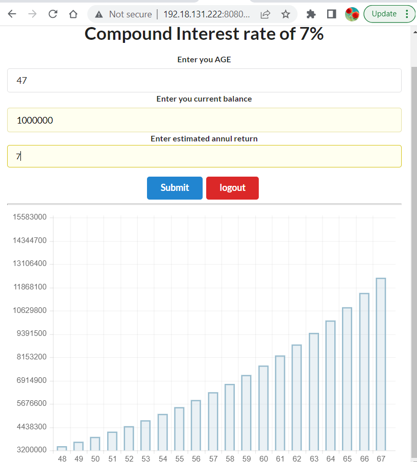
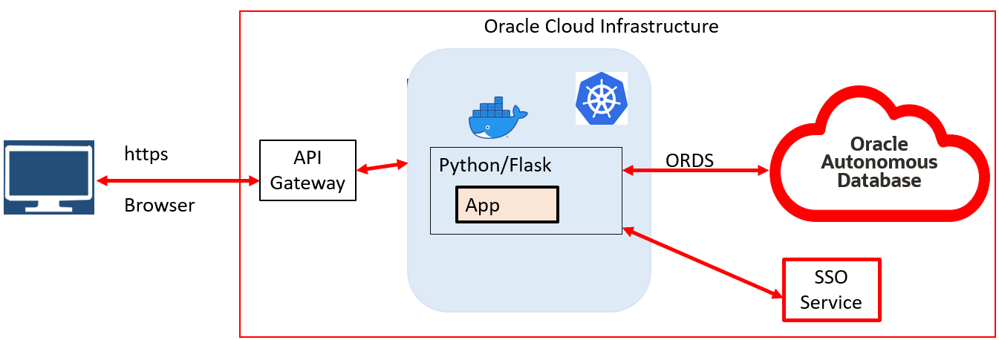

# Introduction

## About this Workshop

In this workshop, you will learn
- Create Oracle Database functions and expose them as Oracle REST APIs (ORDS).
- Enable OAuth2 authentication.
- Deploy a python Application which calls the ORDS in a Kubernetes cluster.
- Integrate the application with SSO.

Estimated Workshop Time: 90 minutes

### About Product/Technology

You will learn how to use the Autonomous Database, the Container Registry, the Kubernetes Cluster (OKE) , Python/Flask  and the API Gateway managed services of the Oracle Cloud Infrastructure through the deployment of a simple Retirement Calculator program.

### Objectives

In this 3 parts lab, you will:
* Provision a Kubernetes cluster, an Oracle Autonomous Database instance, a Container Registry, and an API Gateway.
* Expose Oracle pl/sql function as Oracle Rest APIs.
* Understand, build and deploy a Python/Flask application implementing the REST APIs, using Docker, OCI Container Registry and Oracle Kubernetes service (OKE).

### Prerequisites

* An Oracle Free Tier, Always Free, Paid or LiveLabs Cloud Account

You may now [proceed to the next lab](#next).

## Acknowledgements

* **Author** -  - Vijay Balebail, Dir. Product Management.
* **Contributors** - Christopher Jones, Sr Principal Product Manager.
